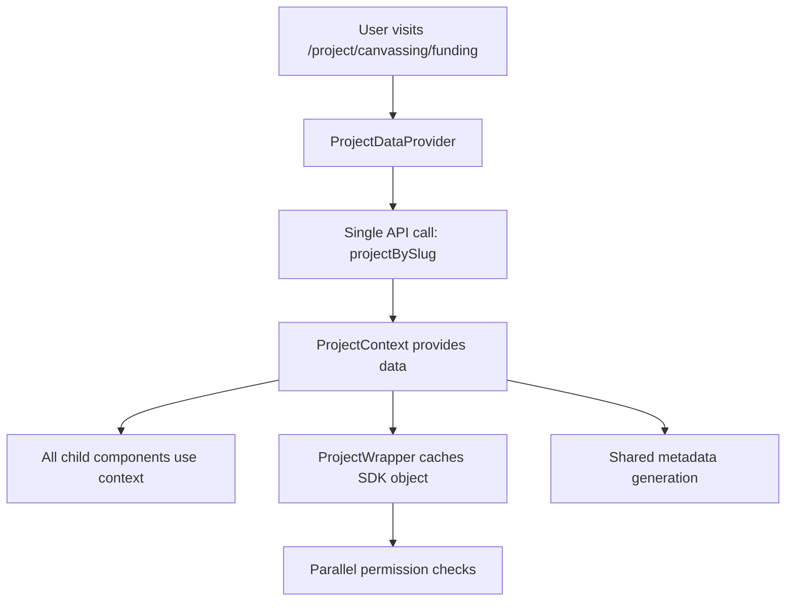

# Project Section Architecture

## Overview
The project section (`/project/[projectId]/*`) uses a modern context-based architecture to eliminate redundant API calls and provide consistent data access across all pages.

## Architecture Pattern

### 1. Single Data Source
```
app/project/[projectId]/layout.tsx
├── ProjectDataProvider (Server Component)
│   ├── Fetches project data once via gapIndexerApi.projectBySlug()
│   ├── Provides data through React Context
│   └── Handles errors with notFound() redirect
└── All child pages receive data from context
```

### 2. Context System
```typescript
// contexts/ProjectContext.tsx
interface ProjectContextData {
  project: IProjectResponse | null;
  loading: boolean;
  error: string | null;
}

// Usage in components
const { project } = useProjectContext();
```

### 3. Smart Caching
- **ProjectWrapper**: Caches SDK project object to avoid permission check redundancy
- **Permission Checks**: Run in parallel using cached data
- **Metadata Generation**: Uses shared utilities instead of individual API calls

## File Structure

### Core Infrastructure
- `contexts/ProjectContext.tsx` - React context for project data
- `app/project/[projectId]/providers/ProjectDataProvider.tsx` - Server-side data fetcher
- `utilities/metadata/projectMetadata.ts` - Shared metadata utilities

### Optimized Pages
All project pages now receive data from context:
- `app/project/[projectId]/page.tsx` - Main project page
- `app/project/[projectId]/team/page.tsx` - Team page
- `app/project/[projectId]/updates/page.tsx` - Updates page
- `app/project/[projectId]/impact/page.tsx` - Impact page
- `app/project/[projectId]/contact-info/page.tsx` - Contact page
- `app/project/[projectId]/funding/**` - All funding-related pages

### Key Components
- `components/Pages/Project/ProjectWrapper.tsx` - Header component with smart caching
- `components/Pages/Project/Grants/Layout.tsx` - Funding layout using context

## Performance Benefits

### Before Optimization
- **6+ redundant API calls** per page load
- Multiple `generateMetadata` functions calling same endpoint
- Separate permission checks making individual API calls

### After Optimization
- **1 main API call** in layout + cached permission checks
- **67% reduction** in API calls
- Shared metadata generation
- Parallel permission checking

## Data Flow



## Error Handling
- **Error Boundaries**: Catch and handle context errors gracefully
- **NotFound Handling**: Automatic 404 for invalid projects
- **Fallback Support**: Store-based fallback for edge cases

## SEO & Metadata
- **Layout-level metadata**: Primary SEO handled at layout level
- **Shared utilities**: Consistent metadata across all pages
- **Social sharing**: All OG tags and Twitter cards preserved

## Future Maintenance
- **Single source of truth**: All project data flows through context
- **Easy debugging**: Centralized data fetching
- **Type safety**: Full TypeScript support throughout
- **Scalable**: Easy to add new project pages without API duplication

## Migration Notes
- All feature flags and fallback code removed
- Components simplified to use context directly
- Backward compatibility maintained through store integration
- Build passes with no regressions 