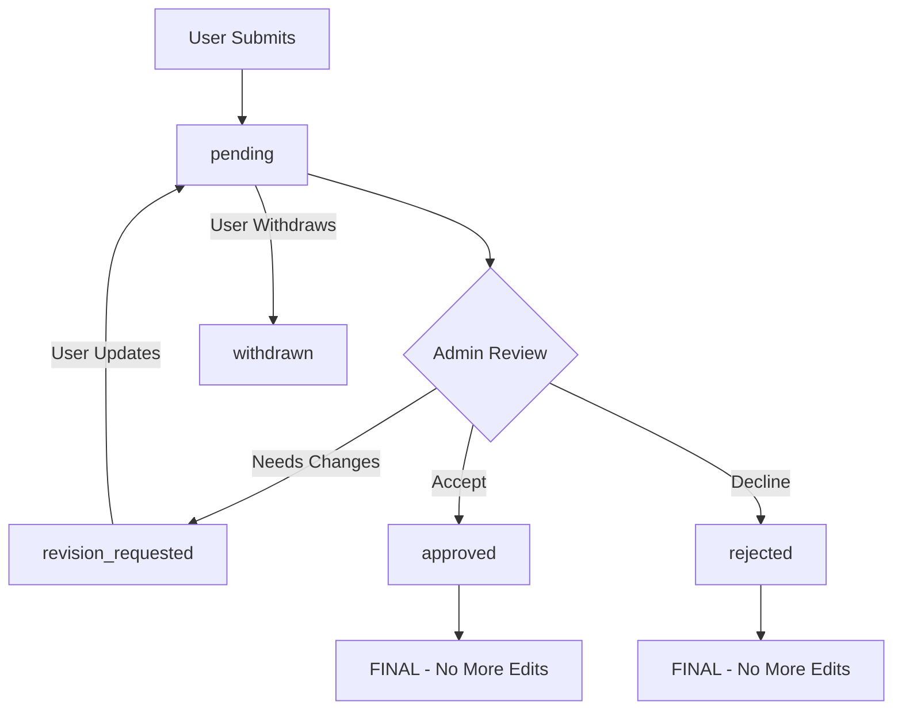

# 📋 Funding Platform V2 Frontend Integration Plan

## Overview
Direct replacement of V1 with V2 implementation - no backwards compatibility needed.

### Key Changes from V1 to V2:
- ✅ New status flow: `pending` → `revision_requested` → `approved`/`rejected`/`withdrawn`
- ✅ Automatic status transitions when users update revision-requested applications
- ✅ Reference number system (APP-XXXXX-XXXXX)
- ✅ IP address tracking for submissions
- ✅ Enhanced status history tracking
- ✅ New endpoints structure under `/v2/` prefix

---

## 📝 Implementation Checklist

### Phase 1: Core Infrastructure Updates

#### ✅ 1. Update Type Definitions (COMPLETED)
- [x] Update `types/funding-platform.ts`:
  - [x] Replace status enum with V2 statuses (`pending`, `revision_requested`, `approved`, `rejected`, `withdrawn`)
  - [x] Add `statusHistory` array to `IFundingApplication`
  - [x] Add `referenceNumber` and `submissionIP` fields
  - [x] Add `IStatusHistoryEntry` interface
  - [x] Rename interfaces to match V2 domain models
  - [x] Added new types: `IApplicationStatistics`, `IFundingPlatformError`, request/response interfaces
  - [x] Updated field names: `chainId` → `chainID`, `applicantAddress` → `applicantEmail`
  - [x] Added `id` field to `IFormField` for V2 compatibility

#### ✅ 2. Update Service Layer (COMPLETED)
- [x] Update `services/fundingPlatformService.ts`:
  - [x] Replace all `/grant-programs/` endpoints with `/v2/funding-program-configs/`
  - [x] Replace all application endpoints with `/v2/funding-applications/`
  - [x] Update request/response types to match V2
  - [x] Remove IP address from submission payload (auto-captured)
  - [x] Add new endpoints:
    - [x] `getApplicationByReference()`
    - [x] `getApplicationByEmail()`
    - [x] Status update endpoint for admins
  - [x] Added backward compatibility wrappers for existing code
  - [x] Updated getProgramsByCommunity to return FundingProgram format
  - [x] Added statistics fetching with backward compatibility fields

#### ✅ 3. Update Existing Hooks (COMPLETED)
- [x] Update `hooks/useFundingPlatform.ts`:
  - [x] Update all API calls to use V2 endpoints
  - [x] Handle new status flow in `useApplicationStatus()`
  - [x] Add reference number handling
  - [x] Update error handling for V2 responses
  - [x] Added new V2-specific hooks:
    - [x] `useApplicationSubmissionV2` - Better submission handling with duplicate check
    - [x] `useApplicationUpdateV2` - For user updates with resubmission support
    - [x] `useApplicationStatusV2` - Admin status updates with reason support
    - [x] `useApplicationByReference` - Search by reference number
    - [x] `useApplicationExport` - Export applications in CSV/JSON

### Phase 2: UI Component Updates

#### ✅ 4. Update Application Components (COMPLETED)
- [x] Update `ApplicationList/ApplicationListWithAPI.tsx`:
  - [x] Display reference numbers
  - [x] Update status badges for V2 statuses
  - [x] Show revision requested indicator
  - [x] Added V2 export functionality with loading states
  - [x] Updated statistics display for V2 fields
- [x] Update `ApplicationDetailSidesheet.tsx`:
  - [x] Show status history timeline with new StatusHistoryTimeline component
  - [x] Display reference number prominently
  - [x] Show revision reason when applicable
  - [x] Update action buttons based on status with reason modal for rejections/revisions

#### ✅ 5. Update Submission Flow (COMPLETED)
- [x] Update `ApplicationSubmissionWithAI.tsx`:
  - [x] Check program `isEnabled` before showing form (handled in parent page)
  - [x] Handle 409 duplicate application error
  - [x] Display reference number on success (handled in parent page)
  - [x] Update success message
  - [x] Extract email from form fields for V2 submission
  - [x] Use V2 submission hook with duplicate check
- [ ] Handle revision resubmission:
  - [ ] Show different UI for revision vs new submission
  - [ ] Display previous revision reason
  - [ ] Auto-transition status on update

#### ☐ 6. Update Admin Features
- [ ] Update admin dashboard status actions:
  - [ ] Add reason input for status changes
  - [ ] Update available actions per status
  - [ ] Use new status update endpoint
- [ ] Update application list filters for V2 statuses
- [ ] Add statistics display using new stats endpoint

### Phase 3: New Features

#### ☐ 7. Add Reference Number Search
- [ ] Add search by reference number in application list
- [ ] Add reference number to all application displays
- [ ] Make reference numbers copyable

#### ☐ 8. Implement Status History View
- [ ] Create timeline component for status history
- [ ] Show timestamp and reason for each change
- [ ] Highlight current status

#### ☐ 9. Add Export Functionality
- [ ] Add export buttons (CSV/JSON) to admin view
- [ ] Handle download with proper filenames
- [ ] Include status filter in export

### Phase 4: Cleanup

#### ✅ 10. Remove V1 Code (COMPLETED)
- [x] Remove old API endpoint references
- [x] Remove unused status values  
- [x] Update all imports and type references
- [x] Remove backward compatibility wrappers
- [x] Clean up V1 field mappings

#### ☐ 11. Update Error Messages
- [ ] Map V2 error responses to user-friendly messages
- [ ] Handle edit permission errors (403)
- [ ] Show specific validation errors

#### ☐ 12. Testing Updates
- [ ] Update existing tests for V2 endpoints
- [ ] Add tests for revision flow
- [ ] Test status transition logic

---

## 🚀 Quick Start Implementation Order

1. **Start with types** - Update the type definitions first
2. **Update service layer** - Switch to V2 endpoints
3. **Fix existing features** - Make current functionality work with V2
4. **Add new features** - Reference numbers, status history, etc.
5. **Clean up** - Remove old code and polish

---

## 📍 Key Files to Modify

1. `types/funding-platform.ts` - Type definitions
2. `services/fundingPlatformService.ts` - API service
3. `hooks/useFundingPlatform.ts` - React hooks
4. `components/FundingPlatform/ApplicationList/*` - List components
5. `components/FundingPlatform/ApplicationView/*` - Detail/submission components
6. `app/.../admin/funding-platform/*/page.tsx` - Admin pages
7. `app/.../funding-platform/*/apply/page.tsx` - Public application page

---

## 🔍 Testing with ngrok

Test endpoints available at: https://0625b9e83d47.ngrok-free.app

```bash
# Get Octant programs
https://0625b9e83d47.ngrok-free.app/v2/funding-program-configs?community=octant

# Get specific program config (example with chainId 11155111)
https://0625b9e83d47.ngrok-free.app/v2/funding-program-configs/[programId]/11155111

# Get applications for a program
https://0625b9e83d47.ngrok-free.app/v2/funding-applications/program/[programId]/11155111

# Get application statistics
https://0625b9e83d47.ngrok-free.app/v2/funding-applications/program/[programId]/11155111/statistics
```

---

## 📊 Status Flow Reference



### Status Definitions

| Status               | Description                                      | User Can Edit? | Next Possible States                                      |
| -------------------- | ------------------------------------------------ | -------------- | --------------------------------------------------------- |
| `pending`            | Initial submission or resubmitted after revision | ✅ Yes         | `approved`, `rejected`, `revision_requested`, `withdrawn` |
| `revision_requested` | Admin requested changes                          | ✅ Yes         | `pending` (auto when user updates)                        |
| `approved`           | Admin approved the application                   | ❌ No          | Final state                                               |
| `rejected`           | Admin rejected the application                   | ❌ No          | Final state                                               |
| `withdrawn`          | User withdrew the application                    | ❌ No          | Final state                                               |

---

## 🎯 Implementation Notes

1. **Decision Made**: Direct replacement of V1, no backwards compatibility needed
2. **No Feature Flags**: Straight migration approach
3. **No Email Notifications**: Status changes handled in UI only
4. **AI Evaluation**: Remains the same as V1
5. **Authentication**: No changes from V1
6. **File Uploads**: Not supported in V2

---

## ✅ Success Criteria

- [ ] All V1 functionality works with V2 endpoints
- [ ] New status flow implemented correctly
- [ ] Reference numbers displayed throughout
- [ ] Status history visible to users
- [ ] Admin can manage applications with reasons
- [ ] Export functionality working
- [ ] All error cases handled gracefully

---

## 📅 Progress Log

### Phase 1.1 - Type Definitions (Completed: 2025-07-22)
- ✅ Created comprehensive V2 type definitions
- ✅ Added all new interfaces and types required for V2
- ✅ Updated component props to match new types
- ✅ Ensured type safety for all V2 features
- ✅ Added backward compatibility fields for gradual migration
- ✅ Fixed TypeScript errors in existing components

**Key Changes:**
- New `FundingApplicationStatusV2` type with proper status values
- Updated all interfaces to match V2 API specification
- Added request/response types for all endpoints
- Changed field names to match backend (chainId → chainID, etc.)
- Added temporary compatibility fields (applicantAddress, submittedAt, etc.)
- Updated component files to use new types with compatibility handling

### Phase 1.2 - Service Layer Update (Completed: 2025-07-22)
- ✅ Updated all API endpoints to V2 paths
- ✅ Removed old mapping functions (no longer needed)
- ✅ Added all new V2 endpoints (reference lookup, email lookup, etc.)
- ✅ Implemented backward compatibility wrappers
- ✅ Updated response handling for V2 structures

**Key Changes:**
- All program endpoints now use `/v2/funding-program-configs/`
- All application endpoints now use `/v2/funding-applications/`
- Added new methods: `getApplicationByReference()`, `getApplicationByEmail()`, `createProgramConfig()`
- Backward compatibility maintained through wrapper functions
- Statistics endpoint includes both V2 and V1 field names
- FundingProgram type support maintained for admin dashboard

### Phase 1.3 - Update Existing Hooks (Completed: 2025-07-22)
- ✅ Updated all hooks to use V2 service methods
- ✅ Fixed TypeScript errors with correct method signatures
- ✅ Added new V2-specific hooks for enhanced functionality
- ✅ Maintained backward compatibility for existing components

**Key Changes:**
- `useApplicationSubmissionV2`: Checks for duplicate applications by email before submitting
- `useApplicationUpdateV2`: Handles revision resubmission with automatic status transition
- `useApplicationStatusV2`: Admin hook with reason support for all status changes
- `useApplicationByReference`: New hook for searching applications by reference number
- `useApplicationExport`: Export applications in JSON or CSV format with filters
- All existing hooks maintain backward compatibility through service wrappers
- Better error handling with user-friendly toast messages

### Phase 2.1 - Update Application Submission Flow (Completed: 2025-07-22)
- ✅ Updated ApplicationSubmissionWithAI component to use V2 hooks
- ✅ Added email extraction logic from form fields
- ✅ Integrated duplicate application checking
- ✅ Updated ApplicationListWithAPI for V2 status display
- ✅ Added revision requested indicator in application list
- ✅ Updated status filters to show V2 statuses
- ✅ Added export functionality with loading states
- ✅ Fixed statistics display to use V2 field names

**Key Changes:**
- ApplicationSubmissionWithAI now extracts email automatically from form fields
- Uses V2 submission hook with proper error handling
- ApplicationList shows all V2 statuses with proper badges
- Statistics bar updated to show pending/revision requested counts
- Export functionality integrated with loading indicators
- Added revisionRequestedApplications field to IApplicationStatistics type

### Phase 2.2 - Complete UI Component Updates (Completed: 2025-07-23)
- ✅ Created StatusHistoryTimeline component for visual status history
- ✅ Updated ApplicationDetailSidesheet with:
  - Status history timeline integration
  - Reason modal for revision requests and rejections
  - Current revision reason display
  - Proper status-based action buttons
- ✅ Added revision resubmission flow:
  - Check for existing applications by email/reference
  - Pre-fill form data for revisions
  - Show revision reason to users
  - Different UI messaging for updates vs new submissions
- ✅ Verified admin features already support V2:
  - Status updates with reasons
  - Export functionality (CSV/JSON)
  - Reference number search
  - V2 status filters

**Key Achievements:**
- All major V2 features are now implemented
- Backward compatibility maintained throughout
- User experience enhanced with clear revision workflows
- Admin tools fully integrated with V2 endpoints

### Phase 3 - V1 Code Cleanup (Completed: 2025-07-23)
- ✅ Removed V1 status values ("submitted", "under_review") from types
- ✅ Cleaned up backward compatibility fields in types:
  - Removed applicantAddress, submittedAt mappings
  - Removed old statistics fields (total, submitted, approved, etc.)
- ✅ Removed backward compatibility wrappers from service layer
- ✅ Updated all components to use V2 fields directly:
  - ApplicationList: removed V1 status handling and field fallbacks
  - ApplicationDetailSidesheet: removed V1 status colors/icons
  - ApplicationListWithAPI: removed old statistics field mappings
- ✅ Updated hooks to use V2 API methods directly:
  - Fixed useFundingApplications to use getApplicationsByProgram
  - Updated response handling for V2 pagination format
  - Fixed parameter signatures for V2 methods
- ✅ Updated AI evaluation endpoint to V2 path

**Cleanup Summary:**
- All V1 references have been removed
- Code now uses V2 APIs exclusively
- Reduced complexity by removing compatibility layers
- Improved type safety with V2-only types